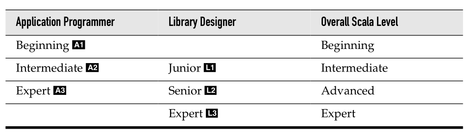

# Scala for the Impatient
---

Solutions for exercises of "Scala for the Impatient, 2nd Edition".

Developed in a IPython Notebook using [Apache Toree](https://toree.apache.org). These notebooks can be imported directly into Jupyter with Spark Kernel or [Try Jupyter](https://try.jupyter.org/) website and can be tweaked or modified to learn / play around more.

## Book
Cay Horstmann's [Scala for the Impatient, 2nd Ed](http://www.horstmann.com/scala/index.html).
Or check [InformIT](http://www.informit.com/store/scala-for-the-impatient-9780134540566) book page.

  

## Scala Levels

## Free download
A1 level chapters [of 1st Edition] can be downloaded for free at [Lightbend](https://www.lightbend.com/resources/e-book/scala-for-the-impatient).

## Chapters and their levels
The [AL][1-3] tags below refer to Martin Odersky's [Scala levels](http://www.scala-lang.org/node/8610).

- [X]  1. [The Basics (A1)](Chapter_01__Basics.ipynb)
- [X]  2. [Control Structures and Functions (A1)](Chapter_02__Control_Structures_and_Functions.ipynb)
- [X]  3. [Working with Arrays (A1)](Chapter_03__Working_with_Arrays.ipynb)
- [X]  4. [Maps and Tuples (A1)](Chapter_04__Maps_and_Tuples.ipynb)
- [ ]  5. Classes (A1)
- [ ]  6. Objects (A1)
- [ ]  7. Packages and Imports (A1)
- [ ]  8. Inheritance (A1)
- [ ]  9. Files and Regular Expressions (A1)
- [ ]  10. Traits (L1)
- [ ]  11. Operators (L1)
- [ ]  12. Higher-Order Functions (L1)
- [ ]  13. Collections (A2)
- [ ]  14. Pattern Matching and Case Classes (A2)
- [ ]  15. Annotations (A2)
- [ ]  16. XML Processing (A2)
- [ ]  17. Futures  (A2)
- [ ]  18. Type Parameters (L2)
- [ ]  19. Advanced Types (L2)
- [ ]  20. Parsing (A3)
- [ ]  21. Implicits (L3)

## Jupyter notebooks online viewer

All the Jupyter notebooks of this repo can be browsed online either here with GitHub or with nbviewer app of jupyter.org. [https://nbviewer.jupyter.org/github/P7h/Scala-for-the-Impatient__Solutions](https://nbviewer.jupyter.org/github/P7h/Scala-for-the-Impatient__Solutions)

Notebooks render beautifully on _nbviewer_ and show the output cells as well as options for downloading the corresponding notebook, etc. This is far better than GitHub's rendering of the notebooks.

## Problems? Questions? Contributions? 
If you find any issues or would like to discuss further, please ping me on my Twitter handle [@P7h](http://twitter.com/P7h "» Twitter/@P7h") or drop me an [email](http://p7h.org/contact/ "» Contact me"). Appreciate your help. Thanks!

## License 
Copyright &copy; 2017 Prashanth Babu. 
Licensed under the [Apache License, Version 2.0](LICENSE).
